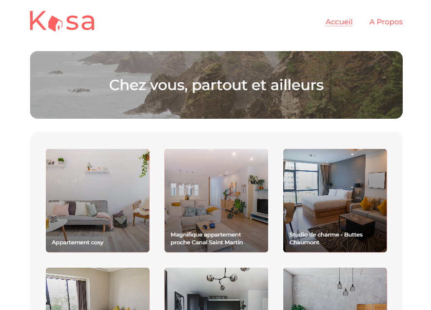
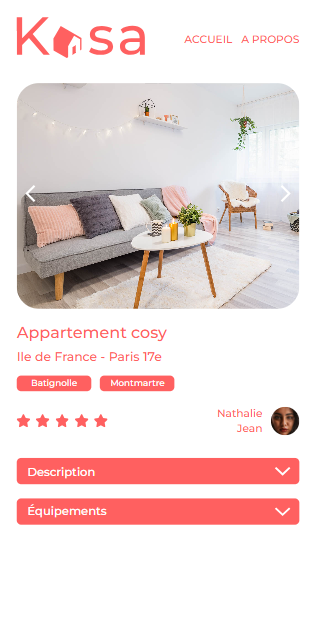

# Kasa

### Français / [English](#english--français)


## Sommaire

- [Description](#description)
- [Fonctionnalités](#fonctionnalités)
- [Technologies utilisées](#technologies-utilisées)
- [Demo](#Demo)
- [Utilisation](#Utilisation)
- [Contact](#contact)
- [Licence](#licence)

## Description

J'ai réalisé ce projet dans le cadre de ma formation chez OpenClassrooms. Kasa est une entreprise fictive spécialisée dans la location d'appartements entre particuliers. Avec près de 10 ans d'expérience et plus de 500 nouvelles annonces publiées chaque jour, elle est devenue l'une des principales références en France.

Mon but était de développer une interface web permettant aux utilisateurs de naviguer facilement parmi les annonces, d'afficher des détails sur chaque logement et de bénéficier d'une expérience utilisateur optimale, que ce soit sur desktop ou mobile. Le projet mettait un accent particulier sur l'aspect responsive et sur l'expérience utilisateur.

Mon objectif principal consistait à intégrer les maquettes fournies en utilisant React et React Router, en assurant une navigation fluide et une présentation claire des informations pour les utilisateurs.

<table>
  <tr>
    <td></td>
    <td></td>
  </tr>
</table>

## Fonctionnalités

- **Responsive Design** : Adaptation à tous les types d'écrans.
- **Liste des logements** : Vue d'ensemble des logements disponibles.
- **Détails du logement** : Informations détaillées de chaque logement.
- **Diaporama** : Exploration visuelle des logements via un diaporama dynamique.
- **Équipements disponibles** : Liste des équipements pour chaque logement.
- **Fonctionnalité Collapse** : Sections interactives pour une meilleure expérience.
- **Navigation optimisée** : Déplacements fluides entre les différentes pages.
- **Gestion des erreurs** : Redirection vers une page 404 pour les routes inexistantes ou les données incorrectes.
- **Logo interactif** : Retour rapide à la page d'accueil en cliquant sur le logo.

## Technologies utilisées

Ce projet a été initialisé avec [Create React App](https://github.com/facebook/create-react-app).

<p >
  <a href="https://skillicons.dev">
    
  </a>
</p>

## Demo

Une demo de l'application est disponible [ici](https://kasa-marine-iguna.vercel.app/)

## Utilisation

### 1. Cloner le projet

```bash
  git clone https://github.com/MarineIg/P7_Kasa.git
```

### 2. Accédez au répertoire du projet

```bash
  cd P7_Kasa
```

### 3. Installer les dépendances

```bash
  npm install
```

### 4. Démarrer le serveur

```bash
  npm run start
```

### 5. Ouvrez votre navigateur et rendez-vous sur http://localhost:3000 pour voir l'application.

## Contact

Pour toute question ou retour sur ce projet, n'hésitez pas à me contacter :


- [LinkedIn](https://www.linkedin.com/in/marine-iguna/)
- marine.iguna@gmail.com

## Licence

Projet n° 7 du parcours developpeur web de la plateforme [OpenClassrooms](https://openclassrooms.com/fr/).

---
---
### English / [Français](#français--english)


## Summary

- [Description](#Description)
- [Features](#features)
- [Technologies used](#technologies-used)
- [Demo](#demo-1)
- [Run Locally](#run-locally)
- [Contact](#contact-1)
- [License](#license)

## Description

I completed this project as part of my training at OpenClassrooms. Kasa is a fictitious company specializing in peer-to-peer apartment rentals. With nearly 10 years of experience and over 500 new listings posted every day, it has become one of the leading references in France.

My goal was to develop a web interface that allows users to easily browse through the listings, display details on each accommodation, and provide an optimal user experience, whether on desktop or mobile. The project placed a particular emphasis on responsive design and user experience.

My main objective was to integrate the provided mock-ups using React and React Router, ensuring smooth navigation and a clear presentation of information for users.

<table>
  <tr>
    <td></td>
    <td></td>
  </tr>
</table>

## Features

- **Responsive Design**: Adapted to all screen types.
- **List of Accommodations**: Overview of available accommodations.
- **Accommodation Details**: Detailed information for each accommodation.
- **Slideshow**: Dynamic visual exploration of accommodations.
- **Equipment Available**: List of equipments for each accommodation.
- **Collapse Feature**: Interactive sections for an enhanced user experience.
- **Optimized Navigation**: Seamless transitions between different pages.
- **Error Handling**: Redirects to a 404 page for non-existent routes or incorrect data.
- **Interactive Logo**: Quick return to the homepage by clicking the logo.


## Technologies used

This project was bootstrapped with [Create React App](https://github.com/facebook/create-react-app).

<p >
  <a href="https://skillicons.dev">
    
  </a>
</p>

## Demo

A live demo is available [here](https://kasa-marine-iguna.vercel.app/)

## Run Locally

### 1. Clone the project

```bash
  git clone https://github.com/MarineIg/P7_Kasa.git
```

### 2. Go to the project directory

```bash
  cd P7_Kasa
```

### 3. Install dependencies

```bash
  npm install
```

### 4. Start the server

```bash
  npm run start
```

### 5. Open your browser and navigate to http://localhost:3000 to view the app.

## Contact

- [LinkedIn](https://www.linkedin.com/in/marine-iguna/)
- marine.iguna@gmail.com

## License

Project n° 7 of the web developer course of the platform [OpenClassrooms](https://openclassrooms.com/fr/).
